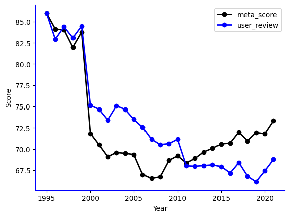
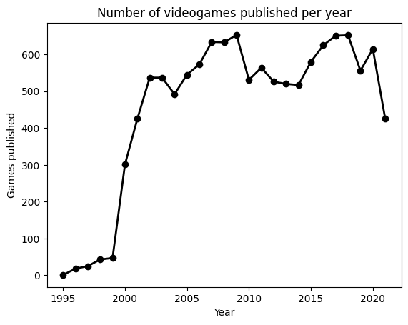

# Video games Industry Analysis

Since first desktop computer video games like Pac-Man, video games industry has been evolving to deliver the best entertainment to users.

The goal of this project is divided into two parts:

- Obtaining a general overview from the video games industry.
- Comparing games to their peers and draw conclusions about their performance.

## Data acquisition

*Metacritics Video games from Kaggle*: This is a CSV containing around 18.000 video games released since 1995 until 2022.

*Using Selenium to obtain genres*: I have used Metacritics URL to also extract genres from a subset of games (around 500).

*Web scraping to obtain Esports tourneys*: I have used web scraping tools to obtain all Esports tourneys organized worldwide since 2012.

*Using Selenium to obtain Twitch info about video games impact*: in this dataset, I have downloaded a total of 84 *.csv* files about video games performance in Twitch.

*Using Selenium and Youtube API to obtain Youtube info about video games impact*: in order to adapt to the number of requests available in the free trial account, I divided this data extraction into two parts:

1. I used Selenium and the advanced search tools from Youtube to obtain videos IDs.

2. I used the Youtube API to obtain data from this videos IDs. Info about this API:
    - Base URL used: https://www.googleapis.com/youtube/v3/videos
    - Parameters:
        - Part: snippet, contentDetails, statistics. It provides detailed information about a video such views, comments, likes, date of publication or length of the video.
        - id: video_id. The alphanumeric code used in the URL to identify a video.
        - key: token.

After a process of data wrangling & data cleaning, I have created a database in MySQL to import all this data.

## Data Analysis & Conclusions

As explained at the beginning, I analyze these data from two different perspectives

### General Overview

- The Jupyter Notebook: **"overview_analysis"** contains a general analyisis of the video games industry.

The main conclusions we can draw from this analysis are the following:

#### Score over time

Except at the beginnning of video games industry, users and critics have always had a different perspective about the likeability of a game. Until 2010, users were really excited about video games, but their demands increase due to their experience on video gaming. Meanwhile, critics consider that developers are getting better each year, thanks to their experience in video gaming creation.

#### Games published over time

In this graph, we can observe a huge increase of video game publications between 2000 - 2005. From that point, this industry has been established and possible COVID has decreased publications due to lack of investment.

#### Which platform is the most used when publishing a video game

As we can easily see, PC is the main platform when creating a video game. We can also see that Playstation has had an increase in games publication from PS2 to PS4. Nevertheless, Xbox One hasn't arrive to the numbers made by Xbox 360.

#### What are the most published genres

In this graph we can see that Action & Action Adventure are by far the genres that lead the genres competition.

#### How genre has changed in history

In this graph we can see the genre evolution over time. Action is the main genre in the last years. That could be because is the genre that generates more adrenaline in users, so it can be a way to be more connected to video gaming.

#### How Twitch is evolving over time

This last graph is shown in order to see how streaming platforms are performing since 2016. The graph shows the evolution of watch time hours per year. There's a huge increase since 2016 until 2021, where it has reeached a peak. In my opinion, it's due to the fact that the streaming industry is a bubble that has had already its peak (thanks in a big part to Fortnite) and it will lower their figures and will establish at a point where it will be at equilibrium.

### One Game Analysis

- The Jupyter Notebook: **"one_game_analysis"**, which compares a single video game with its peers.

I have created a small tool (that I'm going to scalate even more) where you can choose a video game. Then, you can select what kind of information you want to retrieve (tourneys data, youtube data or twitch data) and obtain a report comparing this game data with mean of the data of all its peers. In this tool you can also ask for a global analysis or a specific analysis choosing the year you want to analyize.

As an example, the next two graphs show the performance of Fortnite in Youtube over the year 2019 compared to other games of his status.

As we can easily observe, Fortnite is way above the mean of other games. As a fact, Fortnite became the most popular game in the world that year (even the famous movie saga Avengers introduced a scene on the last movie where Thor was playing this game).

## Files structure

- **Data:** all data obtained in the data acquisition process.
- **Images:** images used in this readme.
- **Notebooks:** all code used in the data wrangling, data cleaning, data analysis and data visualization process.
- **sql:** database creation and some queries.
- **src:** functions created to use in the notebooks files.

## Next Steps

For this project, there are several things that could be done to improve it. Here are some ideas:

- Creating a PDF report based on the graphics created for each game.
- Creating an algorithm that differentiates the level of impact of each game, so it can be compared to its peers and not to all the dataset.
- Creating predictions for the video game industry or a partircular game based on their history.
- Measuring video game updates through Twitch & Youtube videos views and likes.
- Creating a server to feed the database with Youtube info.

## Support

If you have any issue with the code of this project, you can contact me via email: jorgellorente1994@gmail.com

## Libraries

[Pandas](https://pandas.pydata.org/)

[Numpy](https://numpy.org/doc/)

[Seaborn](https://seaborn.pydata.org/index.html)

[Matplotlib](https://matplotlib.org/3.1.1/contents.html)

[Requests](https://pypi.org/project/requests/2.7.0/)

[SQL Alchemy](https://www.sqlalchemy.org/)

[Selenium](https://www.selenium.dev/)