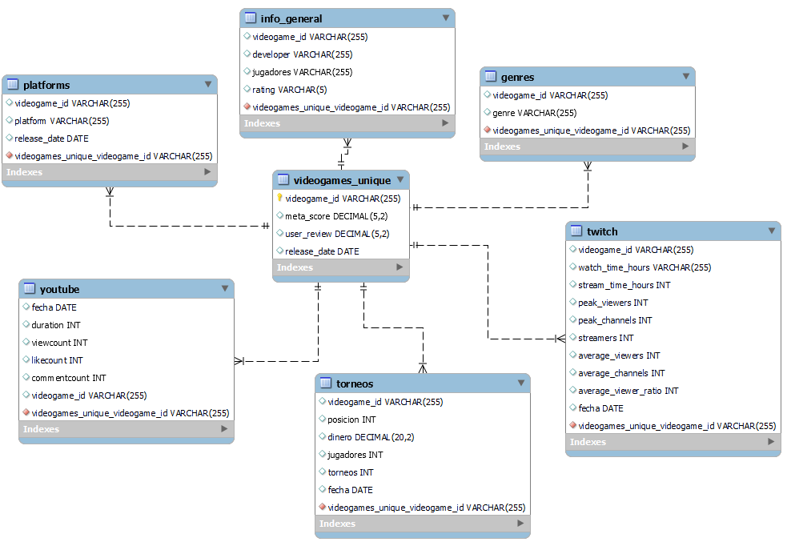

# Video games Industry Analysis

Since first desktop computer video games like Pac-Man, video games industry has been evolving to deliver the best entertainment to users.

The goal of this project is divided into two parts:

- Obtaining a general overview from the video games industry.
- Comparing games to their peers and draw conclusions about their performance.

## Data acquisition

##  # Metacritics Video games from Kaggle

This is a CSV containing around 18.000 video games released since 1995 until 2022.

### Using Selenium to obtain genres

I have used Metacritics URL to also extract genres from a subset of games (around 500).

### Web scraping to obtain Esports tourneys

I have used web scraping tools to obtain all Esports tourneys organized worldwide since 2012.

### Using Selenium to obtain Twitch info about video games impact

In this dataset, I have downloaded a total of 84 *.csv* files about video games performance in Twitch.

### Using Selenium and Youtube API to obtain Youtube info about video games impact

In order to adapt to the number of requests available in the free trial account, I divided this data extraction into two parts:

1. I used Selenium and the advanced search tools from Youtube to obtain videos IDs.

2. I used the Youtube API to obtain data from this videos IDs. Info about this API:
    - Base URL used: https://www.googleapis.com/youtube/v3/videos
    - Parameters:
        - Part: snippet, contentDetails, statistics. It provides detailed information about a video such views, comments, likes, date of publication or length of the video.
        - id: video_id. The alphanumeric code used in the URL to identify a video.
        - key: token.

After a process of data wrangling & data cleaning, I have created a database in MySQL to import all this data.

## Data Analysis

As explained at the beginning, I analyze these data from two different perspectives:

- The Jupyter Notebook: **"overview_analysis"**, which contains a general analyisis of the video games industry.

- The Jupyter Notebook: **"one_game_analysis"**, which compares a single video game with its peers.

## Files structure

- **Data:** all data obtained in the data acquisition process.
- **Images:** images used in this readme.
- **Notebooks:** all code used in the data wrangling, data cleaning, data analysis and data visualization process.
- **sql:** database creation and some queries.
- **src:** functions created to use in the notebooks files.

## Next Steps

For this project, there are several things that could be done to improve it. Here are some ideas:

- Getting cross-data conclusions using MySQL structure.
- Creating a PDF report based on the graphics created for each game.
- Creating functions to only compare each game to their peers (creating an intermediary function to decide the level of impact for each game).
- Creating predictions for the video game industry or a partircular game based on their history.
- Measuring video game updates through Twitch & Youtube videos views and likes.
- Comparing Youtube & Twitch.
- Creating a server to feed the database with Youtube Info (free trial API: 10.000 requests per day)

## Libraries

[Pandas](https://pandas.pydata.org/)

[Numpy](https://numpy.org/doc/)

[Seaborn](https://seaborn.pydata.org/index.html)

[Matplotlib](https://matplotlib.org/3.1.1/contents.html)

[Requests](https://pypi.org/project/requests/2.7.0/)

[SQL Alchemy](https://www.sqlalchemy.org/)

[Selenium](https://www.selenium.dev/)